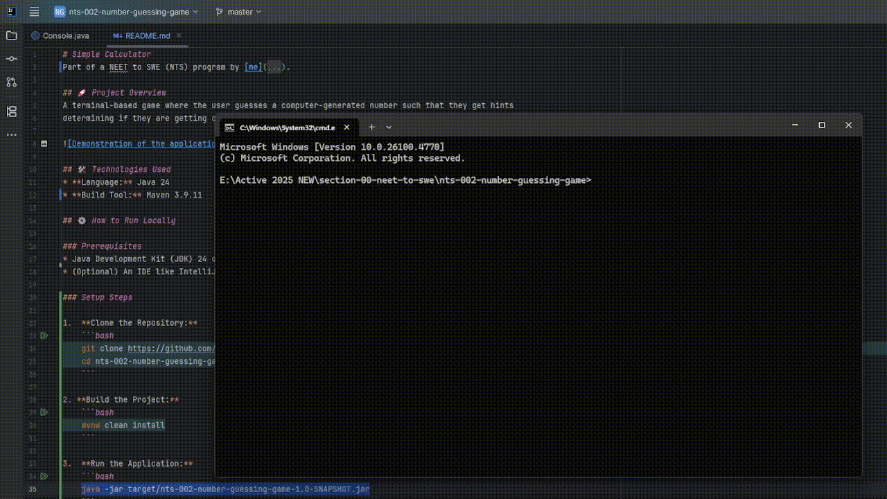

# Number Guessing Game
Part of a NEET to SWE (NTS) program by [me](https://github.com/kevinhe99).

## 🚀 Project Overview
A terminal-based game where the user guesses a computer-generated number such that they get hints
determining if they are getting closer to the number.



## 🛠️ Technologies Used
* **Language:** Java 24
* **Build Tool:** Maven 3.9.11

## ⚙️ How to Run Locally

### Prerequisites
* Java Development Kit (JDK) 24 or higher
* (Optional) An IDE like IntelliJ IDEA or Eclipse

### Setup Steps

1.  **Clone the Repository:**
    ```bash
    git clone https://github.com/KevinHe99/neet-to-swe.git
    cd projects/002-number-guessing-game
    ```

2. **Build the Project:**
    ```bash
    mvnw clean install
    ```

3.  **Run the Application:**
    ```bash
    java -jar target/002-number-guessing-game-1.0-SNAPSHOT.jar
    ```
    
## 📈 Future Enhancements
* Support for high-scores that will be saved locally.
* Support for GUI interface for ease-of-use and better user experience.

## 🤝 Contributing
Contributions are welcome! If you have suggestions or find issues, please open an issue or submit a pull request.

## 📄 License
This project is licensed under the MIT License - see the [LICENSE](LICENSE.md) file for details.